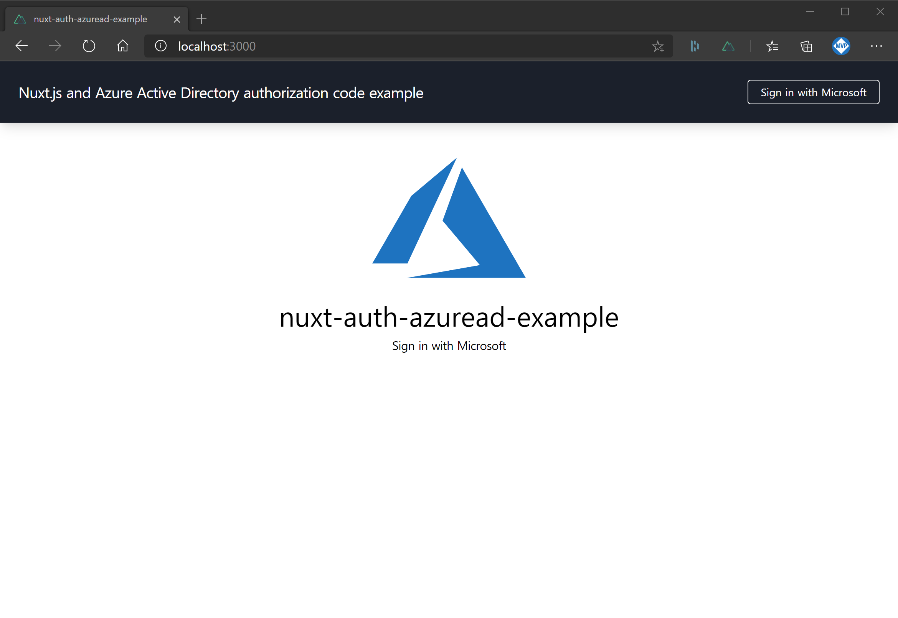
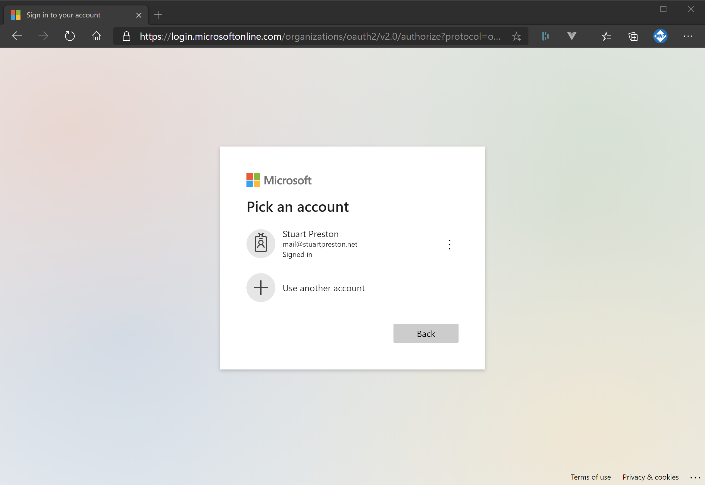
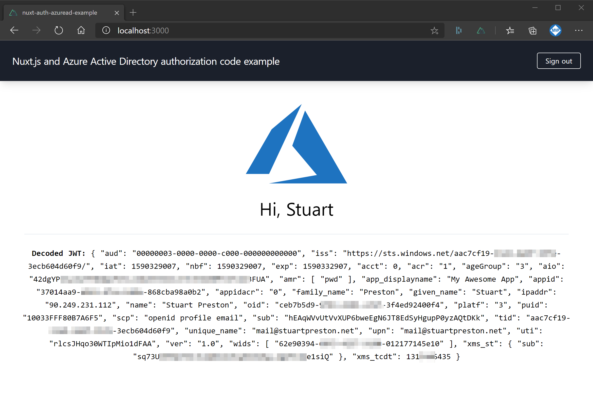

# nuxt-auth-azuread-example

This project demonstrates the use of Nuxt.js Auth module with Azure Active Directory and the OAuth2 Authorization Code (PKCE) flow. It _does not_ require or make use of the Microsoft Authentication Library for JavaScript v2.

A basic demonstration of decoding the `access_token` is shown in order to retrieve basic profile information.

# Screenshots







## Build Setup

```bash
# install dependencies
$ npm install

# serve with hot reload at localhost:3000
$ npm run dev

# build for production and launch server
$ npm run build
$ npm run start

# generate static project
$ npm run generate
```

## How this project was created

```shell
C:\projects\stuartpreston\nuxt-auth-azuread-example [master ≡]> npx create-nuxt-app .

create-nuxt-app v2.15.0
✨  Generating Nuxt.js project in .
? Project name nuxt-auth-azuread-example
? Project description My fantastic Nuxt.js project
? Author name Stuart Preston
? Choose programming language TypeScript
? Choose the package manager Npm
? Choose UI framework Tailwind CSS
? Choose custom server framework Express
? Choose Nuxt.js modules Axios
? Choose linting tools ESLint
? Choose test framework Jest
? Choose rendering mode Single Page App
? Choose development tools jsconfig.json (Recommended for VS Code)
```

Dependencies:

```shell
npm install @nuxtjs/auth-next @nuxtjs/axios jwt-decode
```

Further reading :
<https://stuartpreston.net/2020/05/azure-ad-pkce-spa-nuxt/>

---

## Author

Stuart Preston

## License

Released under an MIT License
